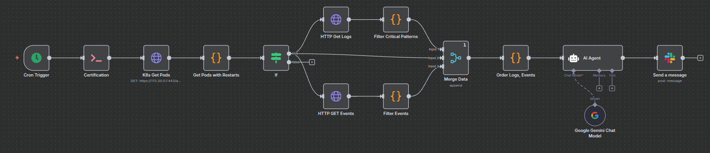

🚀 EKS Anomalies: Automatiza la detección y diagnóstico de fallos en Kubernetes

🔍 Problema que resuelve
Detectar pods con reinicios o fallas en un clúster EKS suele requerir revisar manualmente logs y eventos en Kubernetes, lo que retrasa la respuesta ante incidentes y aumenta el riesgo de downtime.

🛠️ Cómo lo resuelve el flujo
Este workflow ejecuta cada 5 minutos un chequeo en el clúster EKS:

Obtiene un token del ServiceAccount y lista los pods con reinicios.

Extrae sus logs previos y eventos asociados, filtrando patrones críticos (CrashLoopBackOff, OOMKilled, etc.).

Combina la información y la envía a un agente IA (Google Gemini) que diagnostica la causa raíz y recomienda acciones.

Publica el diagnóstico en Slack, notificando al equipo con recomendaciones concretas.

📌 Cómo implementarlo tú también

Crea credenciales para acceder al API de Kubernetes y a Slack.

Importa el flujo JSON en tu instancia de n8n.

Ajusta el endpoint del API, el namespace y el canal de Slack.

Activa el workflow: en minutos tendrás alertas inteligentes de fallos en tus pods.

Este flujo convierte la observabilidad en acciones automáticas, ayudando a equipos DevOps y SRE a reaccionar rápido ante incidentes en producción.

